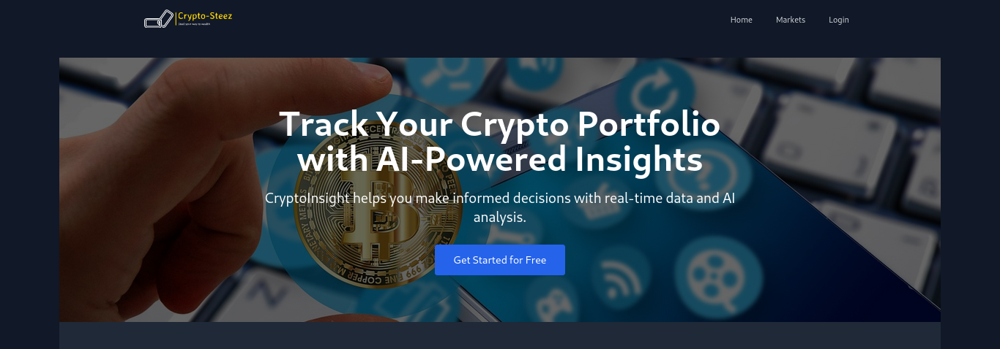

# CryptoInsight: AI-Powered Cryptocurrency Portfolio Tracker

## Table of Contents
1. [Overview](#overview)
2. [Project Structure](#project-structure)
3. [Key Components](#key-components)
4. [Features](#features)
5. [Tech Stack](#tech-stack)
6. [API Integrations](#api-integrations)
7. [Security Measures](#security-measures)
8. [Development Phases](#development-phases)
9. [Testing Strategy](#testing-strategy)
10. [Deployment](#deployment)
11. [Post-Launch](#post-launch)
12. [Legal Considerations](#legal-considerations)

## Overview

CryptoInsight is an advanced cryptocurrency portfolio tracker inspired by CoinStats, with additional unique features leveraging Gemini AI. This application allows users to monitor their crypto investments, access real-time market data, and benefit from AI-powered insights and recommendations.

## Project Structure
cryptoinsight/
├── frontend/
│ ├── src/
│ │ ├── components/
│ │ ├── pages/
│ │ ├── services/
│ │ ├── utils/
│ │ ├── App.tsx
│ │ └── main.tsx
│ ├── public/
│ ├── package.json
│ └── vite.config.ts
├── backend/
│ ├── src/
│ │ ├── controllers/
│ │ ├── models/
│ │ ├── routes/
│ │ ├── services/
│ │ ├── utils/
│ │ └── server.js
│ ├── package.json
│ └── .env
└── README.md

## Key Components

1. **Frontend (React + TypeScript + Vite)**
   - User Interface components
   - State management
   - API integration
   - Charting libraries for portfolio visualization

2. **Backend (Node.js + Express.js)**
   - API endpoints for user authentication, portfolio management, and data retrieval
   - Integration with external APIs (CoinGecko, Gemini AI, Crypto Compare)
   - WebSocket server for real-time updates

3. **Database (MongoDB)**
   - User data storage
   - Portfolio information
   - Transaction history

4. **Caching Layer (Redis)**
   - Session management
   - Caching frequently accessed data for improved performance

## Features

### Core Features (CoinStats Clone)
1. Responsive user interface with dark/light mode
2. User authentication and profile management
3. Dashboard with portfolio overview
4. Detailed asset pages with price charts and market data
5. Portfolio management (add/remove assets, track transactions)
6. Watchlist functionality
7. News feed with personalized content
8. Price alerts and notifications

### Unique AI-Powered Features
1. AI-powered investment suggestions
2. Natural language query interface
3. AI-driven market analysis
4. Automated news summarization
5. Risk assessment
6. Educational content generation
7. Sentiment analysis
8. Natural language alerts

### Additional Unique Features
1. Social trading integration
2. Gamification elements
3. Multi-signature wallet support
4. Virtual portfolio simulator

## Tech Stack

- Frontend: React (with Vite), TypeScript, Tailwind CSS
- Backend: Node.js, Express.js
- Database: MongoDB
- Caching: Redis
- AI Integration: Gemini AI API

## API Integrations

- Cryptocurrency data: CoinGecko API (free tier)
- AI functionality: Gemini AI API
- News aggregation: Crypto Compare API (free tier)

## Security Measures

1. JWT-based authentication with refresh tokens
2. Secure, HTTP-only cookies for token storage
3. Redis for efficient session management
4. Data encryption at rest and in transit
5. API security (rate limiting, Helmet middleware)
6. Input validation and sanitization
7. Regular dependency updates
8. Comprehensive logging and monitoring
9. Multi-factor authentication (MFA)
10. Compliance with data protection regulations

## Development Phases

### Phase 1: Core Functionality
1. Project setup (frontend and backend)
2. Implement basic UI components
3. Develop authentication system
4. Create portfolio management features
5. Integrate cryptocurrency data API

### Phase 2: Advanced Features and AI Integration
1. Implement news feed and watchlist
2. Develop asset details pages with charts
3. Integrate Gemini AI for basic features (queries, suggestions)
4. Implement user settings and preferences

### Phase 3: Unique Features and Polish
1. Develop remaining AI-powered features
2. Implement social trading and gamification
3. Create virtual portfolio simulator
4. Add multi-signature wallet support
5. Conduct thorough testing and optimization

## Testing Strategy

- Unit testing for components and functions
- Integration testing for main user flows
- User acceptance testing
- Performance testing, especially for AI-powered features
- Security testing, including penetration testing and vulnerability assessments

## Deployment

- Frontend: Deploy to Vercel or Netlify
- Backend: Deploy to Heroku or DigitalOcean
- Database: MongoDB Atlas
- Implement CI/CD pipeline using GitHub Actions

## Post-Launch

- Monitor app performance and user feedback
- Plan for feature enhancements and bug fixes
- Explore partnerships and marketing opportunities

## Legal Considerations

- Disclaimer about the project being inspired by CoinStats
- Terms of service and privacy policy
- Compliance with financial regulations (if applicable)

---

## Implementation Phases

### Phase 1: Core Functionality
1. Project setup (frontend and backend)
2. Implement basic UI components
3. Develop authentication system
4. Create portfolio management features
5. Integrate cryptocurrency data API

### Phase 2: Advanced Features and AI Integration
1. Implement news feed and watchlist
2. Develop asset details pages with charts
3. Integrate Gemini AI for basic features (queries, suggestions)
4. Implement user settings and preferences

### Phase 3: Unique Features and Polish
1. Develop remaining AI-powered features
2. Implement social trading and gamification
3. Create virtual portfolio simulator
4. Add multi-signature wallet support
5. Conduct thorough testing and optimization

## Dependencies

### Phase 1: Core Functionality

#### Frontend (client/)
- react
- react-dom
- react-router-dom
- @reduxjs/toolkit
- react-redux
- axios
- tailwindcss
- @headlessui/react
- @heroicons/react
- recharts
- typescript
- vite

#### Backend (server/)
- express
- mongoose
- jsonwebtoken
- bcryptjs
- cors
- dotenv
- helmet
- express-rate-limit
- morgan

### Phase 2: Advanced Features and AI Integration

#### Frontend (client/)
- react-chartjs-2
- chart.js
- react-query
- socket.io-client

#### Backend (server/)
- socket.io
- node-fetch
- redis

### Phase 3: Unique Features and Polish

#### Frontend (client/)
- react-beautiful-dnd (for drag-and-drop functionality)
- react-toastify (for notifications)

#### Backend (server/)
- @google-cloud/vertexai (for Gemini AI integration)
- node-cron (for scheduled tasks)

## API Integrations

- Cryptocurrency data: CoinGecko API (free tier)
- AI functionality: Gemini AI API
- News aggregation: Crypto Compare API (free tier)

## Security Measures

[Security Measures section remains unchanged]

## Testing Strategy

- Unit testing: Jest for both frontend and backend
- Integration testing: Supertest for backend API testing
- End-to-end testing: Cypress for frontend testing
- Performance testing: Apache JMeter for load testing
- Security testing: OWASP ZAP for vulnerability scanning

## Deployment

- Frontend: Deploy to Vercel or Netlify
- Backend: Deploy to Heroku or DigitalOcean
- Database: MongoDB Atlas
- Caching: Redis Labs or AWS ElastiCache
- Implement CI/CD pipeline using GitHub Actions

## Post-Launch